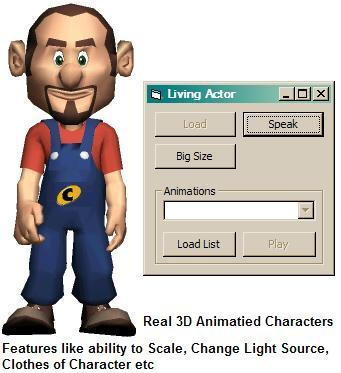



## Living Actor Technology \(OpenGL 3D Actors\)

### Description

Just like MS-Agent, Living Actor is a revolutionary embodied Agent technology that makes it possible for companies to add an animated and interactive character to their applications without making any change to their application's window, or webpages. But it&#8217;s more advanced than MS Agent because the characters are rendered on screen using OpenGL 3D techniques, not using bitmaps like in MS Agent. Making it in 3D also has its own advantages like characters size is small (jus few KBs) unlike MS Agent&#8217;s few MBs. Since it&#8217;s using 3D technology it easy to manipulate the characters in real-time.
 
### More Info
 

             |
---                |---
**Submitted On**   |2006-02-20 00:40:12
**By**             |[Abhishek\.NET](https://github.com/Planet-Source-Code/PSCIndex/blob/master/ByAuthor/abhishek-net.md)
**Level**          |Intermediate
**User Rating**    |4.1 (29 globes from 7 users)
**Compatibility**  |VB 4\.0 \(32\-bit\), VB 5\.0, VB 6\.0, VB Script, ASP \(Active Server Pages\) , VBA MS Access, VBA MS Excel
**Category**       |[Complete Applications](https://github.com/Planet-Source-Code/PSCIndex/blob/master/ByCategory/complete-applications__1-27.md)
**World**          |[Visual Basic](https://github.com/Planet-Source-Code/PSCIndex/blob/master/ByWorld/visual-basic.md)
**Archive File**   |[Living\_Act1975012212006\.zip](https://github.com/Planet-Source-Code/abhishek-net-living-actor-technology-opengl-3d-actors__1-64384/archive/master.zip)

